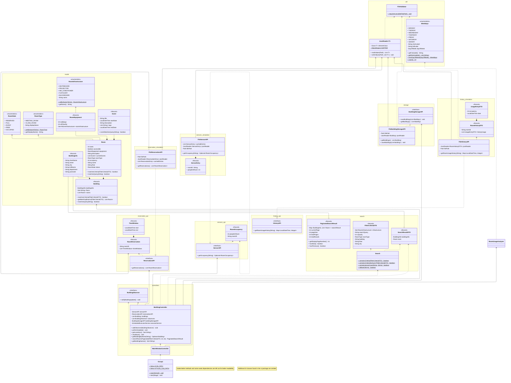

```mermaid
---
config:
    layout: elk
---
classDiagram
    direction BT
    note "Getter/setter methods and some weak dependencies are left out for better readability"
    note "Additional UI classes found in the ui package are omitted"

    class Occupi {
        + String ICON_PATH$
        + String STYLES_CSS_PATH$
        + main(String[]) void$
        + start(Stage) void
    }

    namespace controllers {
        class MainWindowController {
        }

        class BuildingController {
            - SensorAPI sensorAPI
            - ReservationAPI reservationAPI
            - List~Building~ buildings
            - List~BuildingObserver~ observers
            - BuildingStorageAPI buildingStorageAPI
            - ScheduledExecutorService executorService
            + addObserver(BuildingObserver) void
            + performUpdate() void
            + getLocations() Set~String~
            + shutdown() void
            + getBuildingByName(String) Optional~Building~
            + searchRoomsPaginated(FilterCriteriaDTO, int, int) PaginatedSearchResult
            + getBuildingNames() Set~String~
        }

        class BuildingObserver {
            <<Interface>>
            + notifyBuildingUpdate() void
        }
    }
    namespace model {
        class Room {
            - int seats
            - boolean accessible
            - RoomEquipment equipment
            - String description
            - List~Event~ currentEvents
            - RoomType roomType
            - int occupancy
            - String name
            - String floor
            - RoomState status
            + matchesCriteria(FilterCriteriaDTO) boolean
            + matchesQuery(String) boolean
        }

        class RoomEquipment {
            <<Record>>
            - int wallplugs
            - int wifiQuality
            - Set~RoomInfrastructure~ roomInfrastructure
        }

        class RoomInfrastructure {
            <<enumeration>>
            +  WHITEBOARD
            +  PROJECTOR
            +  AIR_CONDITIONER
            +  FLIPCHART
            +  BLACKBOARD
            - String name
            + getByName(String) RoomInfrastructure$
            + getName() String
        }

        class RoomType {
            <<enumeration>>
            +  MEETING_ROOM
            +  CLASS_ROOM
            - String displayName
            + getByName(String) RoomType$
            + getDisplayName() String
        }

        class RoomState {
            <<enumeration>>
            +  RESERVED
            +  FULL
            +  EVENT
            +  FREE
            +  OCCUPIED
        }

        class Event {
            <<Record>>
            - String title
            - LocalDateTime startDate
            - String description
            - List~String~ tags
            - LocalDateTime endDate
            + eventMatchesQuery(String) boolean
        }

        class Building {
            <<Record>>
            - BuildingInfo buildingInfo
            - Set~String~ floors
            - List~Room~ rooms
            + matchesCriteria(FilterCriteriaDTO) boolean
            + getMatchingRooms(FilterCriteriaDTO) List~Room~
            + matchesQuery(String) boolean
        }

        class BuildingInfo {
            <<Record>>
            - String shortName
            - String street
            - String city
            - String fullName
            - String department
            - String postcode
        }
    }

    namespace reservation_api {
        class ReservationAPI {
            <<Interface>>
            + getReservations() List~RoomReservation~
        }
        class TimeWindow {
            <<Record>>
            - LocalDateTime start
            - LocalDateTime end
        }
        class RoomReservation {
            <<Record>>
            - String roomID
            - List~TimeWindow~ timeWindows
        }
    }

    namespace reservation_simulation {
        class FileReservationAPI {
            - Path filePath
            - JsonReader~ReservationEntry~ jsonReader
            - List~ReservationEntry~ cachedEntries
            + getReservations() List~RoomReservation~
        }
    }
    namespace sensors_api {
        class RoomOccupancy {
            <<Record>>
            - int peopleInRoom
            - String roomID
        }
        class SensorAPI {
            <<Interface>>
            + getOccupancy(String) Optional~RoomOccupancy~
        }
    }

    namespace sensors_simulation {
        class FileSensorAPI {
            - List~SensorEntry~ cachedEntries
            - JsonReader~SensorEntry~ jsonReader
            - Path filePath
            + getOccupancy(String) Optional~RoomOccupancy~
        }

        class SensorEntry {
            <<Record>>
            + roomID: String
            + peopleInRoom: int
        }
    }

    namespace storage {
        class BuildingStorageAPI {
            <<Interface>>
            + saveBuildings(List~Building~) void
            + getBuildings() List~Building~
        }

        class FileBuildingStorageAPI {
            - Path filePath
            - JsonReader~Building~ jsonReader
            + getBuildings() List~Building~
            + saveBuildings(List~Building~) void
        }
    }

    namespace history_api {
        class HistoryAPI {
            <<Interface>>
            + getRoomUsageHistory(String) Map~LocalDateTime, Integer~
        }
    }

    namespace history_simulation {
        class FileHistoryAPI {
            - JsonReader~RoomHistoryDTO~ jsonReader
            - Path filePath
            + getRoomUsageHistory(String) Map~LocalDateTime, Integer~
        }

        class RoomHistoryDTO {
            <<Record>>
            - String roomId
            - List~UsageEntryDTO~ historyUsage
        }

        class UsageEntryDTO {
            <<Record>>
            - int occupancy
            - LocalDateTime date
        }
    }

    namespace search {
        class FilterCriteriaDTO {
            <<Record>>
            - Set~RoomInfrastructure~ infrastructure
            - String searchQuery
            - int capacity
            - RoomType roomType
            - String building
            - String floor
            - String city
        }

        class PaginatedSearchResult {
            <<Record>>
            - Map~BuildingInfo, List~ Room~~ searchResult
            - int currentPage
            - int pageSize
            - int totalPages
            - int totalResults
            + getDisplayPageNumber() int
            + hasNext() boolean
            + hasPrevious() boolean
        }

        class Search {
            + containsCriteria(FilterCriteriaDTO) boolean$
            + containsCriteriaNoQuery(FilterCriteriaDTO) boolean$
            + containsIgnoreCase(String, String) boolean$
            + isBlank(String) boolean$
        }

        class SearchResultDTO {
            <<Record>>
            - BuildingInfo buildingInfo
            - Room room
        }
    }

    namespace util {
        class JsonReader~T~ {
            - Class~T~ elementClass
            - ObjectMapper MAPPER$
            + readValues(Path) List~T~
            + writeValues(Path, List~T~) void
        }

        class FileValidator {
            + requireAccessibleFile(Path) void$
        }

        class Weekdays {
            <<enumeration>>
            +  MONDAY
            +  TUESDAY
            +  WEDNESDAY
            +  THURSDAY
            +  FRIDAY
            +  SATURDAY
            +  SUNDAY
            - String shortLabel
            - String fullLabel
            - DayOfWeek dayOfWeek
            + getFullLabel() String
            + getShortLabels() List~String~$
            + fromDayOfWeek(DayOfWeek) Weekdays$
            + count() int$
        }
    }

%%Main
    Occupi ..> MainWindowController
%%Model
    Building *-- BuildingInfo
    Building *-- Room
    Room --> RoomState
    Room --> RoomType
    Room *-- RoomEquipment
    Room *-- Event
    RoomEquipment --> RoomInfrastructure
%%Controllers
    BuildingController --> Building
    BuildingController --> SensorAPI
    BuildingController --> ReservationAPI
    BuildingController ..> Search
    BuildingController ..> SearchResultDTO
    BuildingController --> BuildingObserver
    BuildingController --> BuildingStorageAPI
    MainWindowController ..> BuildingObserver
    MainWindowController --> BuildingController
    MainWindowController --> RoomUsageAnalyzer
%%Storage
    FileBuildingStorageAPI ..|> BuildingStorageAPI
    FileBuildingStorageAPI --> JsonReader~T~
    FileBuildingStorageAPI ..> FileValidator
%%History
    HistoryAPI <|.. FileHistoryAPI
    FileHistoryAPI --> JsonReader~T~
    FileHistoryAPI --> RoomHistoryDTO
    FileHistoryAPI ..> FileValidator
    RoomHistoryDTO *-- UsageEntryDTO
%%Reservations
    ReservationAPI <|.. FileReservationAPI
    ReservationAPI ..> RoomReservation
    FileReservationAPI --> JsonReader~T~
    FileReservationAPI --> RoomReservation
    RoomReservation *-- TimeWindow
%%Sensors
    FileSensorAPI --> JsonReader~T~
    FileSensorAPI ..> RoomOccupancy
    SensorAPI <|.. FileSensorAPI
    SensorAPI ..> RoomOccupancy
    SensorEntry *.. FileSensorAPI
%%UI
    RoomUsageAnalyzer ..> Weekdays
%%Util
    JsonReader~T~ ..> FileValidator
%%Search
    SearchResultDTO o-- BuildingInfo
    PaginatedSearchResult o-- BuildingInfo
    Search ..> FilterCriteriaDTO
    Search ..> SearchResultDTO

```