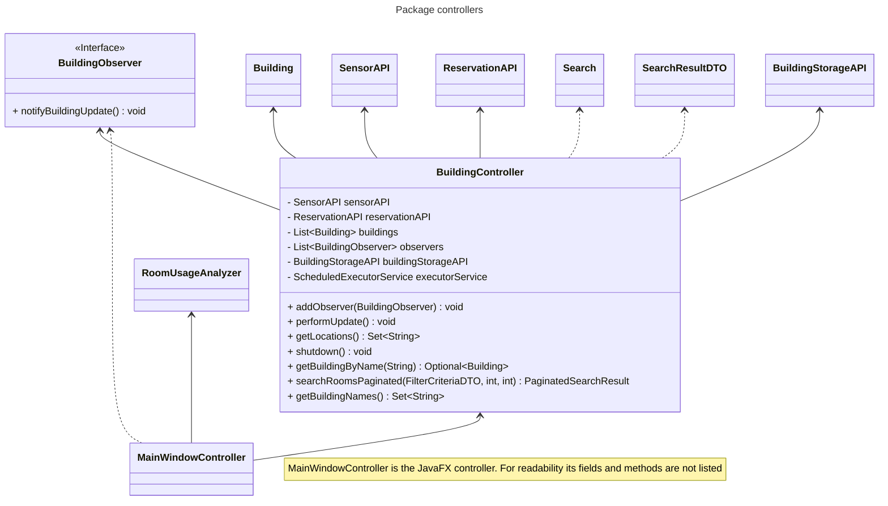

```mermaid
---
title: Package controllers
---
classDiagram
    direction BT
    note "MainWindowController is the JavaFX controller. For readability its fields and methods are not listed"

    class MainWindowController {
    }

    class BuildingController {
        - SensorAPI sensorAPI
        - ReservationAPI reservationAPI
        - List~Building~ buildings
        - List~BuildingObserver~ observers
        - BuildingStorageAPI buildingStorageAPI
        - ScheduledExecutorService executorService
        + addObserver(BuildingObserver) void
        + performUpdate() void
        + getLocations() Set~String~
        + shutdown() void
        + getBuildingByName(String) Optional~Building~
        + searchRoomsPaginated(FilterCriteriaDTO, int, int) PaginatedSearchResult
        + getBuildingNames() Set~String~
    }

    class BuildingObserver {
        <<Interface>>
        + notifyBuildingUpdate() void
    }

    BuildingController --> Building
    BuildingController --> SensorAPI
    BuildingController --> ReservationAPI
    BuildingController ..> Search
    BuildingController ..> SearchResultDTO
    BuildingController --> BuildingObserver
    BuildingController --> BuildingStorageAPI
    MainWindowController ..> BuildingObserver
    MainWindowController --> BuildingController
    MainWindowController --> RoomUsageAnalyzer
```