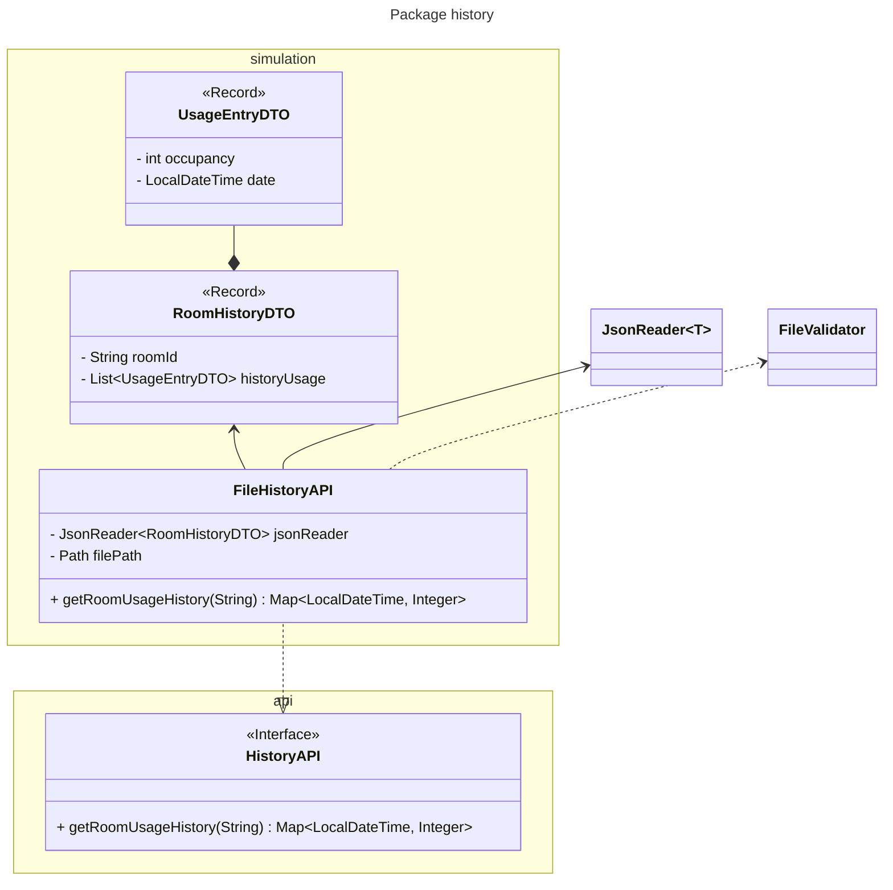

```mermaid
---
title: Package history
---
classDiagram
    direction BT

    namespace api {
        class HistoryAPI {
            <<Interface>>
            + getRoomUsageHistory(String) Map~LocalDateTime, Integer~
        }
    }

    namespace simulation {
        class FileHistoryAPI {
            - JsonReader~RoomHistoryDTO~ jsonReader
            - Path filePath
            + getRoomUsageHistory(String) Map~LocalDateTime, Integer~
        }

        class RoomHistoryDTO {
            <<Record>>
            - String roomId
            - List~UsageEntryDTO~ historyUsage
        }

        class UsageEntryDTO {
            <<Record>>
            - int occupancy
            - LocalDateTime date
        }
    }
    HistoryAPI <|.. FileHistoryAPI
    FileHistoryAPI --> JsonReader~T~
    FileHistoryAPI --> RoomHistoryDTO
    FileHistoryAPI ..> FileValidator
    RoomHistoryDTO *-- UsageEntryDTO
```