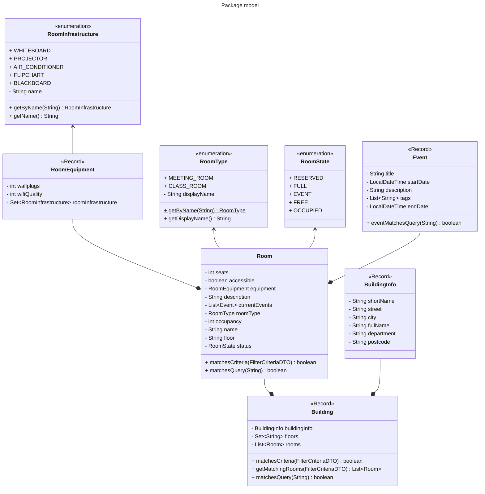

```mermaid
---
title: Package model
---
classDiagram
    direction BT

    class Room {
        - int seats
        - boolean accessible
        - RoomEquipment equipment
        - String description
        - List~Event~ currentEvents
        - RoomType roomType
        - int occupancy
        - String name
        - String floor
        - RoomState status
        + matchesCriteria(FilterCriteriaDTO) boolean
        + matchesQuery(String) boolean
    }

    class RoomEquipment {
        <<Record>>
        - int wallplugs
        - int wifiQuality
        - Set~RoomInfrastructure~ roomInfrastructure
    }

    class RoomInfrastructure {
        <<enumeration>>
        +  WHITEBOARD
        +  PROJECTOR
        +  AIR_CONDITIONER
        +  FLIPCHART
        +  BLACKBOARD
        - String name
        + getByName(String) RoomInfrastructure$
        + getName() String
    }

    class RoomType {
        <<enumeration>>
        +  MEETING_ROOM
        +  CLASS_ROOM
        - String displayName
        + getByName(String) RoomType$
        + getDisplayName() String
    }

    class RoomState {
        <<enumeration>>
        +  RESERVED
        +  FULL
        +  EVENT
        +  FREE
        +  OCCUPIED
    }

    class Event {
        <<Record>>
        - String title
        - LocalDateTime startDate
        - String description
        - List~String~ tags
        - LocalDateTime endDate
        + eventMatchesQuery(String) boolean
    }

    class Building {
        <<Record>>
        - BuildingInfo buildingInfo
        - Set~String~ floors
        - List~Room~ rooms
        + matchesCriteria(FilterCriteriaDTO) boolean
        + getMatchingRooms(FilterCriteriaDTO) List~Room~
        + matchesQuery(String) boolean
    }

    class BuildingInfo {
        <<Record>>
        - String shortName
        - String street
        - String city
        - String fullName
        - String department
        - String postcode
    }

    Building *-- BuildingInfo
    Building *-- Room
    Room --> RoomState
    Room --> RoomType
    Room *-- RoomEquipment
    Room *-- Event
    RoomEquipment --> RoomInfrastructure

```