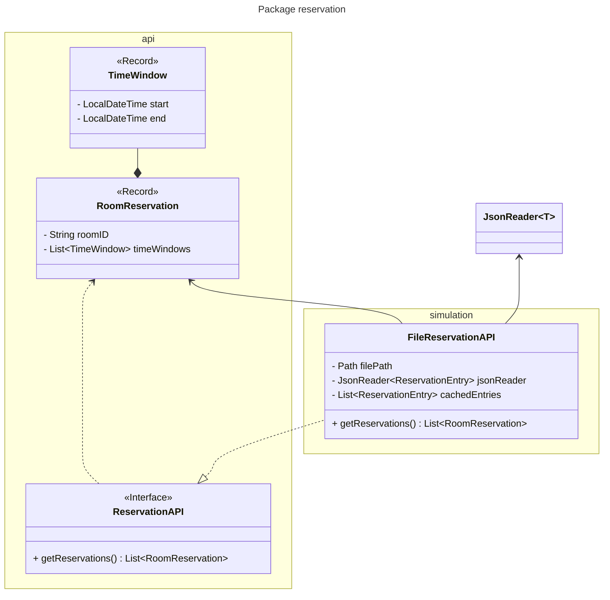

```mermaid
---
title: Package reservation
---
classDiagram
    direction BT

    namespace api {
        class ReservationAPI {
            <<Interface>>
            + getReservations() List~RoomReservation~
        }
        class TimeWindow {
            <<Record>>
            - LocalDateTime start
            - LocalDateTime end
        }
        class RoomReservation {
            <<Record>>
            - String roomID
            - List~TimeWindow~ timeWindows
        }
    }

    namespace simulation {
        class FileReservationAPI {
            - Path filePath
            - JsonReader~ReservationEntry~ jsonReader
            - List~ReservationEntry~ cachedEntries
            + getReservations() List~RoomReservation~
        }
    }
    
    ReservationAPI <|.. FileReservationAPI
    ReservationAPI ..> RoomReservation
    FileReservationAPI --> JsonReader~T~
    FileReservationAPI --> RoomReservation
    RoomReservation *-- TimeWindow
```