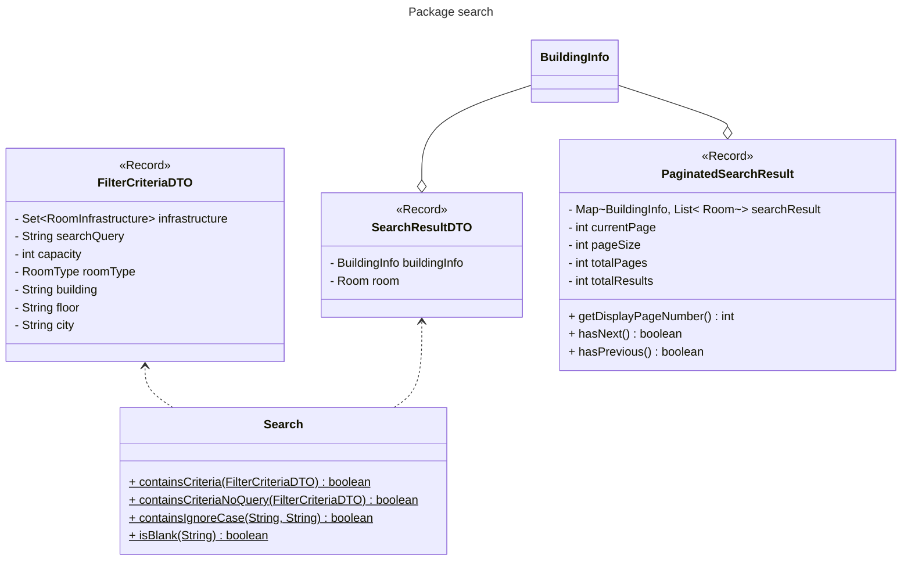

```mermaid
---
title: Package search
---
classDiagram
    direction BT

    class FilterCriteriaDTO {
        <<Record>>
        - Set~RoomInfrastructure~ infrastructure
        - String searchQuery
        - int capacity
        - RoomType roomType
        - String building
        - String floor
        - String city
    }

    class PaginatedSearchResult {
        <<Record>>
        - Map~BuildingInfo, List~ Room~~ searchResult
        - int currentPage
        - int pageSize
        - int totalPages
        - int totalResults
        + getDisplayPageNumber() int
        + hasNext() boolean
        + hasPrevious() boolean
    }

    class Search {
        + containsCriteria(FilterCriteriaDTO) boolean$
        + containsCriteriaNoQuery(FilterCriteriaDTO) boolean$
        + containsIgnoreCase(String, String) boolean$
        + isBlank(String) boolean$
    }

    class SearchResultDTO {
        <<Record>>
        - BuildingInfo buildingInfo
        - Room room
    }

    SearchResultDTO o-- BuildingInfo
    PaginatedSearchResult o-- BuildingInfo
    Search ..> FilterCriteriaDTO
    Search ..> SearchResultDTO

```