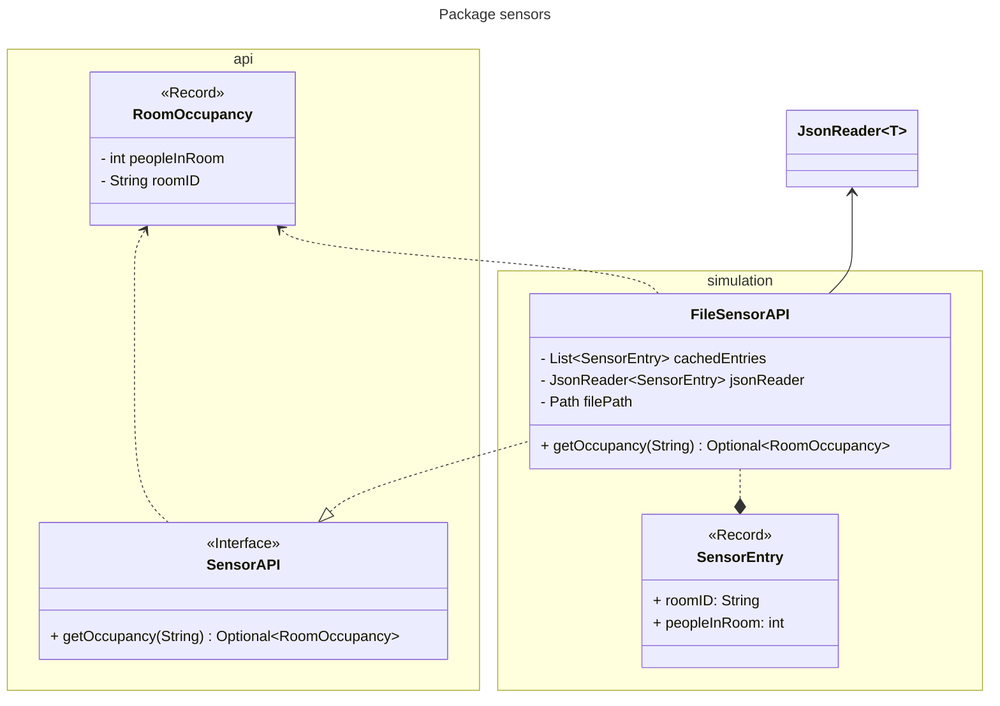

```mermaid
---
title: Package sensors
---
classDiagram
    direction BT

    namespace api {
        class RoomOccupancy {
            <<Record>>
            - int peopleInRoom
            - String roomID
        }
        class SensorAPI {
            <<Interface>>
            + getOccupancy(String) Optional~RoomOccupancy~
        }
    }

    namespace simulation {
        class FileSensorAPI {
            - List~SensorEntry~ cachedEntries
            - JsonReader~SensorEntry~ jsonReader
            - Path filePath
            + getOccupancy(String) Optional~RoomOccupancy~
        }

        class SensorEntry {
            <<Record>>
            + roomID: String
            + peopleInRoom: int
        }
    }

    FileSensorAPI --> JsonReader~T~
    FileSensorAPI ..> RoomOccupancy
    SensorAPI <|.. FileSensorAPI
    SensorAPI ..> RoomOccupancy
    SensorEntry *.. FileSensorAPI

```