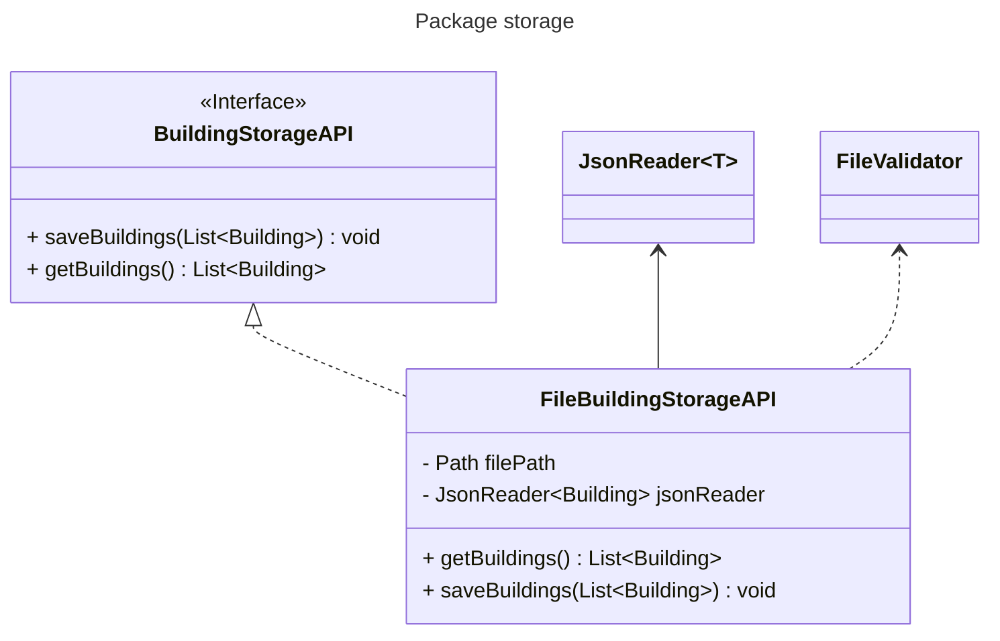

```mermaid
---
title: Package storage
---
classDiagram
    direction BT
    class BuildingStorageAPI {
        <<Interface>>
        + saveBuildings(List~Building~) void
        + getBuildings() List~Building~
    }

    class FileBuildingStorageAPI {
        - Path filePath
        - JsonReader~Building~ jsonReader
        + getBuildings() List~Building~
        + saveBuildings(List~Building~) void
    }

    FileBuildingStorageAPI ..|> BuildingStorageAPI
    FileBuildingStorageAPI --> JsonReader~T~
    FileBuildingStorageAPI ..> FileValidator
```