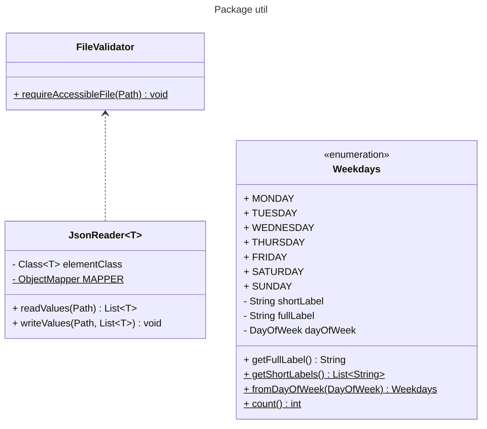

```mermaid
---
title: Package util
---
classDiagram
    direction BT
    class JsonReader~T~ {
        - Class~T~ elementClass
        - ObjectMapper MAPPER$
        + readValues(Path) List~T~
        + writeValues(Path, List~T~) void
    }

    class FileValidator {
        + requireAccessibleFile(Path) void$
    }

    class Weekdays {
        <<enumeration>>
        +  MONDAY
        +  TUESDAY
        +  WEDNESDAY
        +  THURSDAY
        +  FRIDAY
        +  SATURDAY
        +  SUNDAY
        - String shortLabel
        - String fullLabel
        - DayOfWeek dayOfWeek
        + getFullLabel() String
        + getShortLabels() List~String~$
        + fromDayOfWeek(DayOfWeek) Weekdays$
        + count() int$
    }
    JsonReader~T~ ..> FileValidator

```